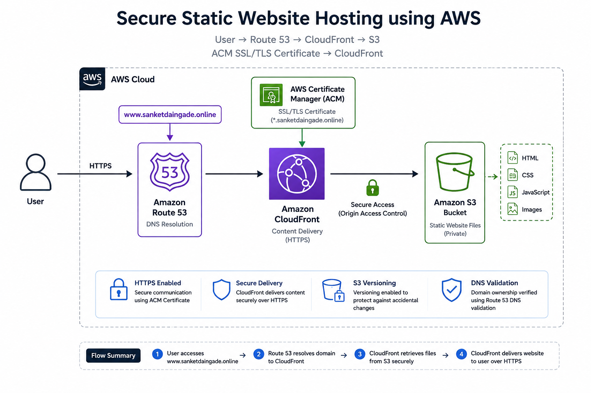

# 🚀 Secure Static Website Hosting using AWS

A secure and scalable static website hosting solution built using **Amazon S3, Amazon CloudFront, AWS Certificate Manager (ACM), and Amazon Route 53**.

The project demonstrates how to host static website files in Amazon S3, deliver them securely through CloudFront, enable HTTPS using ACM, and connect a custom domain using Route 53.

---

##  Project Overview

This project implements a **secure static website hosting architecture on AWS**.

The website's static files are stored in an Amazon S3 bucket. Amazon CloudFront is used as the content delivery layer to provide fast and secure access to the website. AWS Certificate Manager provides the SSL/TLS certificate for HTTPS, while Amazon Route 53 handles DNS resolution for the custom domain.

##  Architecture

### Architecture Diagram



### Architecture Flow

```text
User
  │
  │ HTTPS Request
  ▼
Amazon Route 53
  │
  │ DNS Resolution
  ▼
Amazon CloudFront
  │
  │ Secure Origin Access
  ▼
Amazon S3
  │
  └── Static Website Files

AWS Certificate Manager (ACM)
          │
          └── SSL/TLS Certificate
                │
                ▼
           CloudFront
```

---

##  How It Works

1. The user accesses `www.sanketdaingade.online`.
2. Amazon Route 53 resolves the custom domain to the CloudFront distribution.
3. CloudFront receives the HTTPS request.
4. CloudFront retrieves the required static content from the S3 bucket.
5. CloudFront delivers the website content to the user over HTTPS.
6. AWS Certificate Manager provides the SSL/TLS certificate used by CloudFront.

---

##  AWS Services Used

| AWS Service                       | Purpose                                  |
| --------------------------------- | ---------------------------------------- |
| **Amazon S3**                     | Stores static website files              |
| **Amazon CloudFront**             | Global content delivery and HTTPS        |
| **AWS Certificate Manager (ACM)** | Provides SSL/TLS certificate             |
| **Amazon Route 53**               | DNS management and custom domain routing |

---

##  AWS Configuration

### 1. Amazon S3

**Bucket Name:** `sanket-static-website-v1`

Configuration:

* S3 bucket created for static website files
* Bucket Versioning enabled
* Uploaded HTML, CSS, JavaScript and image files
* S3 used as the origin for CloudFront

---

### 2. AWS Certificate Manager

**Certificate:** `*.sanketdaingade.online`

Configuration:

* **Region:** `us-east-1` (N. Virginia)
* **Validation:** DNS Validation
* Validation record configured using Route 53
* **Status:** Issued
* Certificate attached to CloudFront

> CloudFront uses ACM certificates from the `us-east-1` region.

---

### 3. Amazon CloudFront

**Distribution Name:** `static-web-hosting`

Configuration:

* **Origin:** Amazon S3
* **Alternate Domain Name:** `www.sanketdaingade.online`
* **SSL/TLS Certificate:** `*.sanketdaingade.online`
* **Default Root Object:** `index.html`
* HTTPS enabled
* CloudFront used for secure content delivery

---

### 4. Amazon Route 53

**Hosted Zone:** `sanketdaingade.online`

Configuration:

* Custom domain configured
* DNS validation record created for ACM
* **A Alias Record** configured
* **AAAA Alias Record** configured
* Alias records point to the CloudFront distribution

---

##  Security Features

The project implements several AWS security and reliability features:

*  HTTPS enabled using AWS Certificate Manager
*  CloudFront used as the secure content delivery layer
*  Secure access between CloudFront and S3
*  DNS validation used for certificate verification
*  S3 Versioning enabled
*  S3 is not intended to be accessed directly by end users
*  Custom domain secured with an SSL/TLS certificate

---

##  Repository Structure

```text
Secure-Static-Website-Hosting/
│
├── architecture/
│   └── architecture.png
│
├── project-guide/
│   └── AWS-Static-Website-Hosting-Guide.pdf
│
├── website/
│   ├── index.html
│   ├── style.css
│
└── README.md
```

---

##  Project Guide

A detailed step-by-step guide is included in this repository.

The guide covers:

* S3 bucket creation and configuration
* Website file upload
* S3 Versioning
* ACM certificate creation
* DNS validation using Route 53
* CloudFront distribution creation
* Custom domain configuration
* HTTPS configuration
* Route 53 A/AAAA Alias records
* Website deployment and verification

 **[View Project Guide](project-guide/AWS-Static-Website-Hosting-Guide.pdf)**

---

##  Key Learnings

Through this project, I gained hands-on experience with:

* Amazon S3 static website hosting
* Amazon CloudFront distribution configuration
* AWS Certificate Manager
* SSL/TLS and HTTPS
* Amazon Route 53 DNS management
* DNS validation
* Custom domain configuration
* Secure content delivery
* S3 Versioning
* Basic AWS cloud security practices

---

##  Technologies & Services

```text
AWS
├── Amazon S3
├── Amazon CloudFront
├── AWS Certificate Manager
└── Amazon Route 53

Protocols
├── HTTPS
└── DNS

Web Technologies
├── HTML
├── CSS
└── JavaScript
```

---

##  Final Result

The static website was successfully deployed on AWS and is accessible through the custom domain:

###  https://www.sanketdaingade.online

The website is delivered securely over **HTTPS using Amazon CloudFront and AWS Certificate Manager**.

---
